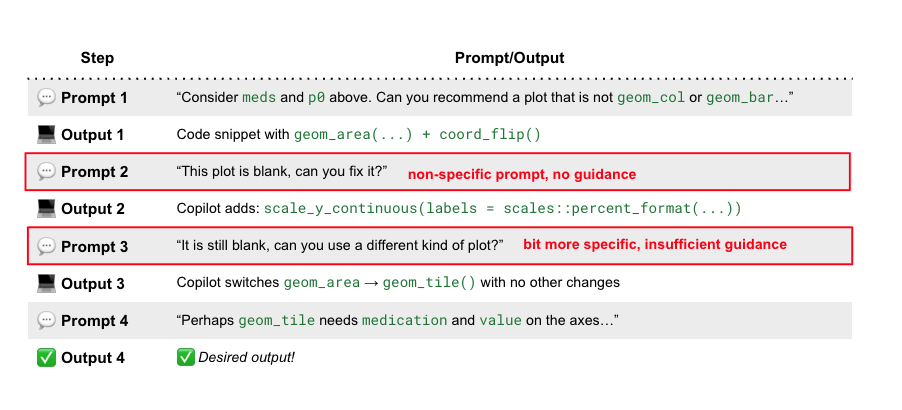

## Copilot prompts are vital to your output

### Best practices

Adding Copilot as a pair programmer to your RStudio is simple, and has a seamless interface. Take a look at Posit's documentation [here](https://docs.posit.co/ide/user/ide/guide/tools/copilot.html).

### Potential pitfalls of an improper prompt

Prompt writing is both rewarding and tricky. What we get depends entirely on what we give. 
Consider this situation where we're interesting in plotting an unusual data structure using the diabetes dataset from UCI ML repo -- the 23 diabetes medications that have 4 levels, _No_, _Steady_, _Up_ and _Down_.
We already used a barplot to visualize this data, and we now want Copilot to recommend a different "type" of plot that will allow for more granular insights. How do we do this?

